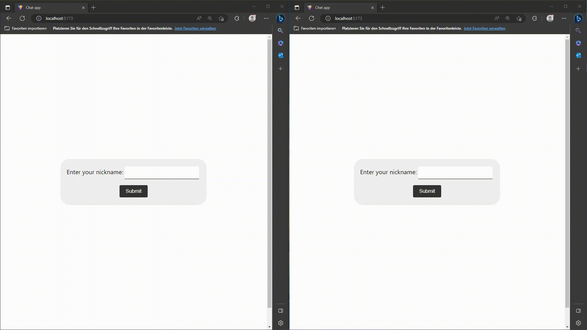

# Real-time Chat Application

A real-time chat application built with React.js (using Vite) and Node.js, powered by Socket.IO for real-time communication.

## Demo

[Live demo here](https://react-express-chat-app-demo.netlify.app/)

<p align="center">
  
</p>

## 🚀 Getting Started

### Prerequisites

- Install [Node.js](https://nodejs.org/en/download) (v14.x.x or higher)
- A code editor such as [IntelliJ Ultimate](https://www.jetbrains.com/idea/download) or [Visual Studio Code](https://code.visualstudio.com/download)
- [GitHub Desktop](https://desktop.github.com/) (optional, for cloning the repository)

### Installation

1. Clone the repository using GitHub Desktop or the command line:

   ```
   git clone http://github.com/shoebjoarder/react-chat-app.git
   ```

2. Open the project with your code editor (IntelliJ IDEA or VSCode).

3. Install the client dependencies:

   ```bash
   cd client
   npm ci
   ```

4. Start the Vite development server:

   ```bash
   npm start
   ```

5. Install the server dependencies:

   ```bash
   cd server
   npm ci
   ```

6. Start the Node.js server:

   ```bash
   npm start
   ```

7. Open multiple browser windows and navigate to:

   ```
   http://localhost:5173
   ```

Now you can test the real-time chat application by sending messages from different browser windows.

## 📝 License

This project is [MIT](LICENSE) licensed.
